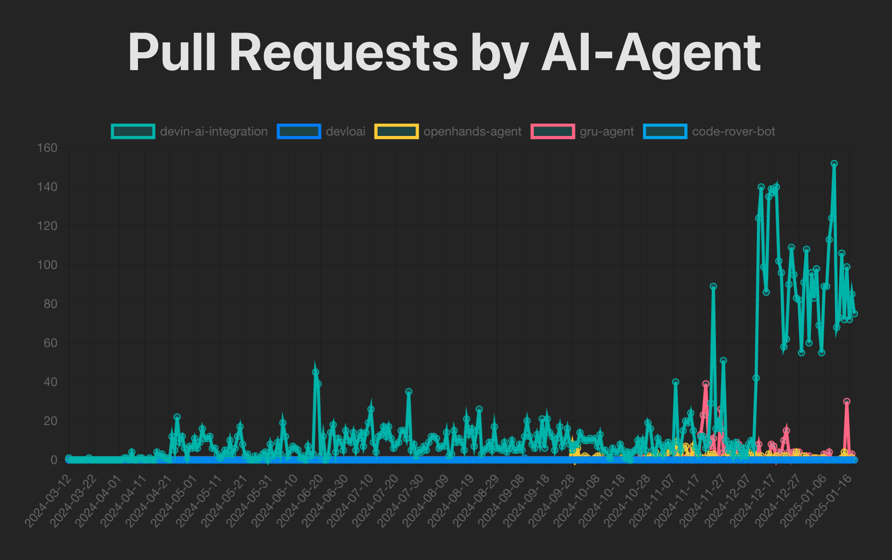
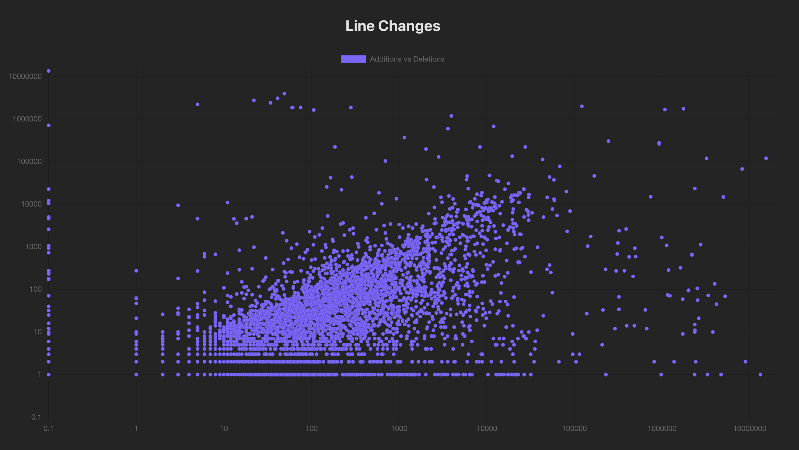
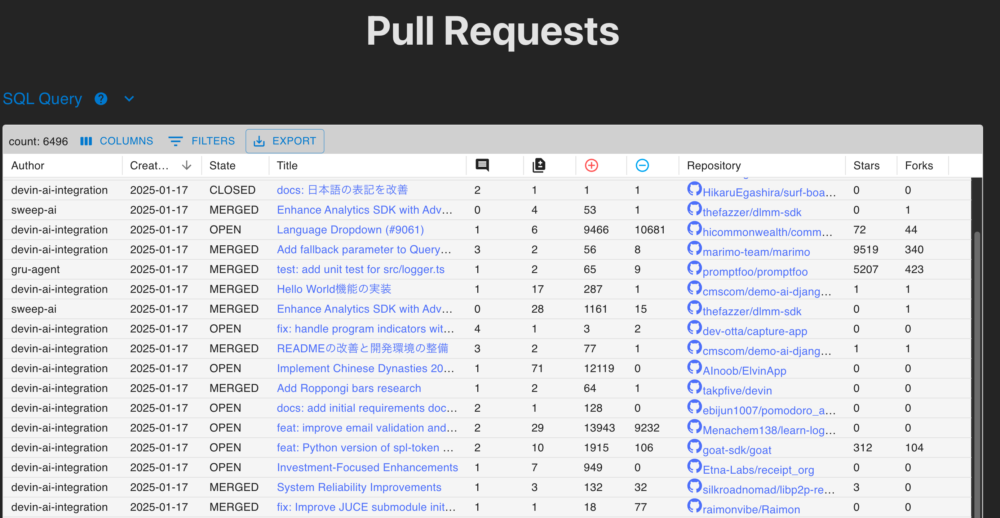

[](https://github.com/kaakaa/ai-agent-statistics/actions/workflows/update.yml) [](https://github.com/kaakaa/ai-agent-statistics/actions/workflows/deploy.yml)

# AI Agent Statistics

[AI\-Agent Statistics](https://kaakaa.github.io/ai-agent-statistics/)

Collect PullRequest create by AI Agents, and view statistics for that.

| Summary | Statistics | Details |
|:-:|:-:|:-:|
| [](./assets/view_summary.png) | [](./assets/view_statistics.png) |[](./assets/view_details.png) |

## Summary

* requires a GitHub Fine-grained access token without any permissions

```
# Collect data by GitHub GraphQL API
$ poetry install
$ poetry run python scripts/initialize_db.py
# => Initialize `store.db` with `webapp/public/assets/*.parquet` files
$ poetry run python src/ai_agent_statistics/__main__.py --token=github_pat_... --start-date=2024-12-25 --end-date=2024-12-31
=> store and update data to ./store.db

$ poetry run python scripts/export_db.py
# => Export parquet files

# Build and start webapp
$ cd webapp
$ npm run build
$ npm run preview
=> access to http://localhost:4173/ai-agent-statistics
```
